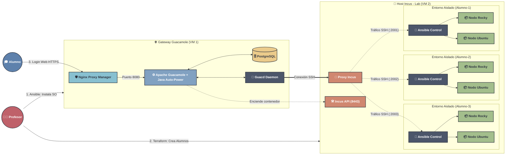

<div align="center">

# 🚀 Infraestructura Híbrida: Laboratorio de Ansible con Incus y Guacamole


</div>

Bienvenido al repositorio oficial del **Laboratorio de Ansible**. Esta infraestructura automatizada despliega entornos de aprendizaje aislados (contenedores LXC/Incus) para estudiantes y les proporciona acceso remoto instantáneo vía web (Apache Guacamole) sin necesidad de instalar VPNs o clientes SSH.

Cuenta con un módulo de inteligencia desarrollado en Java que permite que las máquinas de los estudiantes permanezcan apagadas (consumo 0) y se enciendan automáticamente en 3 segundos solo cuando el alumno se conecta.

---

## 🏛️ Arquitectura del Sistema

La solución está dividida en dos servidores (nodos) desplegados en AWS o cualquier otro proveedor de nube.



### 🧩 Componentes Clave
* **Terraform:** Como orquestador principal. Define cuántos alumnos existen y aprovisiona sus contenedores y cuentas en Guacamole simultáneamente.
* **Ansible:** Como preparador de "Día 0". Instala las bases de Docker, Incus, actualiza servidores y aplica configuraciones de seguridad.
* **Incus (Zabbly):** Gestor de contenedores de sistema. Ejecuta entornos Ubuntu y RockyLinux ligeros.
* **Guacamole Java Module:** Un `.jar` programado a la medida que lee la base de datos, conecta con la API de Incus y gestiona el ciclo de vida de energía.

---

## 🛠️ Requisitos Previos

1. Dos servidores Linux (Ubuntu 24.04 recomendado).
2. El archivo de llave SSH `laboratorio-ansible.pem` ubicado en la raíz de este proyecto.
3. Modificar las direcciones IP de tus servidores en:
   * `inventory.yml` y `inventory_guac.yml` (Para Ansible).
   * `incus_production/main.tf` y `guacamole_production/docker-compose.yml` (Para Terraform y Docker).

---

## 📂 Estructura del Proyecto

El repositorio está organizado en carpetas de producción y playbooks de automatización, centralizando todo el despliegue de infraestructura inicial exclusivamente a través de **Ansible**:

```text
├── README.md                      # Esta documentación
├── inventory.yml                  # Inventario Ansible para el Servidor Incus y Guacamole
├── setup_incus_lab.yml            # Playbook Ansible: Instala y configura Incus, Zabbly y red
├── setup_guacamole.yml            # Playbook Ansible: Instala Docker y sube guacamole_production
│
├── guacamole_production/          # Paquete de despliegue web
│   ├── docker-compose.yml         # Orquestador de Guacamole, Postgres y Nginx Proxy Manager
│   ├── .env                       # Variables seguras de entorno
│   ├── 01-initdb.sql              # Estructura inicial de la DB
│   └── data/guacamole/extensions/ # Extensiones Java compiladas (Ansible Theme, Auto-Power, PostgreSQL)
│
└── incus_production/              # Paquete de aprovisionamiento de alumnos
    └── main.tf                    # Código Terraform que crea N alumnos, contenedores y cuentas web
```

---

## 🚀 Despliegue Centralizado con Ansible

Todo el proceso de **Día 0** (preparar servidores en blanco para producción) se ejecuta exclusivamente a través de Ansible. No es necesario entrar a los servidores manualmente.

### Paso 1: Preparación del Laboratorio (Servidor Incus)
Instala las bases de LXC, Zabbly, afina los límites de `sysctl` para alta densidad de contenedores, y expone la API 8443.

```bash
ansible-playbook -i inventory.yml setup_incus_lab.yml
```

### Paso 2: Preparación del Portal Web (Servidor Guacamole)
Instala Docker de forma limpia, crea los volúmenes, sube todo el paquete de la carpeta `guacamole_production/` y arranca la arquitectura web.

```bash
ansible-playbook -i inventory.yml setup_guacamole.yml
```

### Paso 3: Aprovisionar Alumnos (Terraform)
Una vez que Ansible dejó los dos servidores 100% listos, usamos Terraform como **Día 1** para inyectar a los alumnos. La infraestructura como código creará mágicamente los usuarios web, perfiles, redes, y contenedores.

```bash
terraform init
terraform apply
```

> [!WARNING]
> **Atención al caché del navegador:** Si eliminas y recreas a un alumno usando Terraform, su ID interno cambiará. Si el alumno usa la pestaña "Conexiones Recientes" (Recent Connections) de Guacamole, dará error. Indícales que usen siempre la lista **"Todas las Conexiones" (All Connections)** que está más abajo.

---

## 🧠 Flujo de Auto-Apagado Inteligente

Para ahorrar recursos en la nube (RAM/CPU), este laboratorio cuenta con un sistema de auto-gestión de energía (Just-In-Time Boot).

```mermaid
%%{init: { 'theme': 'dark', 'themeVariables': { 'noteBkgColor': '#3B4252', 'noteTextColor': '#ECEFF4', 'actorTextColor': '#ECEFF4', 'activationBkgColor': '#88C0D0' } } }%%
sequenceDiagram
    autonumber
    
    %% Definición de Actores y Participantes
    actor U as 🎓 Alumno
    participant T as 🛠️ Terraform
    participant G as ⚙️ Guacamole Java
    participant C as 📦 Contenedor Incus

    %% Fase 1: Provisión (Fondo azul oscuro)
    rect rgb(28, 35, 49)
        Note right of T: FASE 1: Provisión de Infraestructura
        T->>+C: Crea y enciende el contenedor
        Note over C: cloud-init toma 45 seg<br/>instalando OpenSSH...
        C->>-C: Termina setup y se APAGA automáticamente
    end

    %% Fase 2: Conexión (Fondo verde oscuro)
    rect rgb(25, 42, 34)
        Note right of U: FASE 2: Acceso del Usuario (Posterior)
        U->>+G: Inicia sesión en el portal
        U->>G: Clic en "Terminal Ansible"
        G->>+C: API: incus start (Enciende máquina)
        Note over G,C: Espera 3 segundos...
        G->>C: Establece conexión SSH
        C-->>-U: 💻 Consola lista para usarse
    end

    %% Fase 3: Desconexión y Timeout (Fondo rojo oscuro)
    rect rgb(50, 28, 32)
        Note right of U: FASE 3: Desconexión y Ahorro de Recursos
        U->>G: Cierra ventana del navegador web
        deactivate G
        
        G->>+G: Inicia temporizador interno
        Note over G: Pasan 10 minutos sin reconexión...
        G->>-C: API: incus stop (Apaga máquina)
        Note over C: Contenedor apagado<br/>(Ahorro de RAM/CPU)
    end
```



1. **El Nacimiento:** Al ejecutar `terraform apply`, los contenedores nacen encendidos. El servicio `cloud-init` instala SSH en segundo plano y ejecuta `power_state: poweroff` al terminar. El contenedor se apaga (demora ~45 seg).
2. **El Ingreso:** El alumno hace clic. El módulo Java emite un `incus start`, espera 3 segundos de gracia (`INCUS_BOOT_DELAY_MS`), y conecta la terminal.
3. **El Apagado:** Si el alumno cierra la pestaña, el módulo arranca un cronómetro de 10 minutos (`INCUS_TIMEOUT_MINUTES`). Si no vuelve a entrar, apaga el contenedor para liberar la RAM de tu servidor.

---

## 🎨 Tema Gráfico

La consola inyecta automáticamente el esquema de colores **Nord Theme** directamente a la base de datos de Guacamole usando un `local-exec` provisioner en Terraform.

Si recibes errores al ejecutar el tema, asegúrate de que tu llave `laboratorio-ansible.pem` esté siempre en la misma carpeta desde donde ejecutas `terraform apply`.
